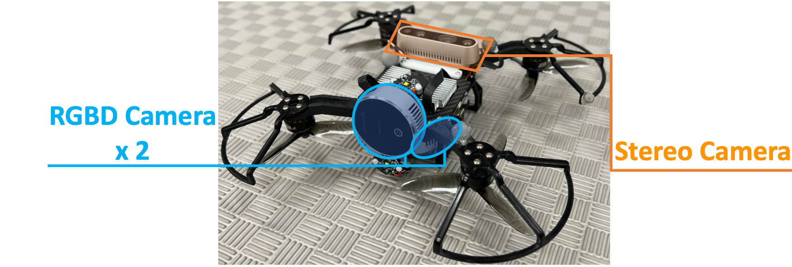
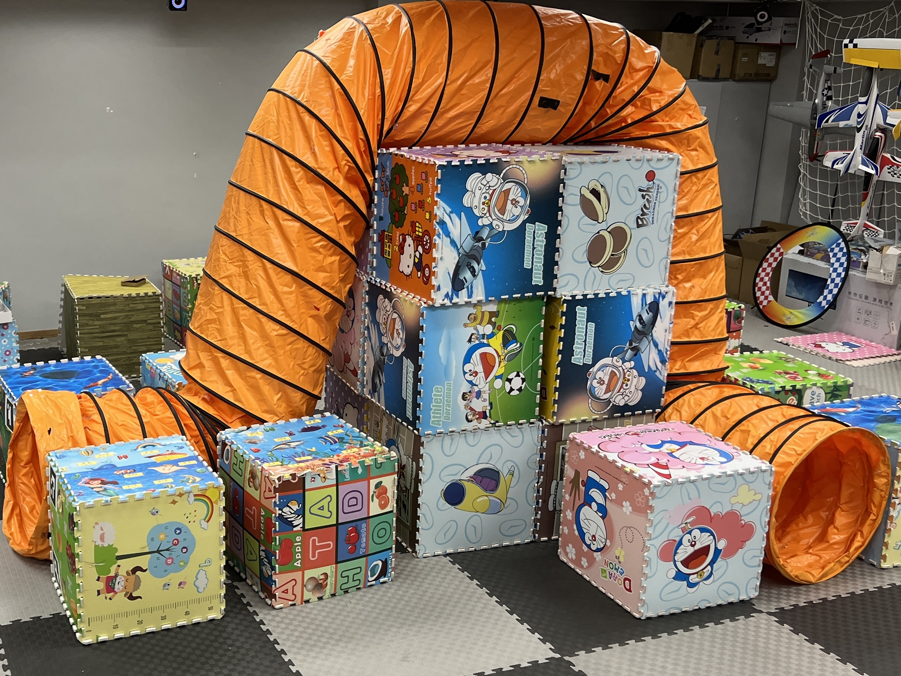
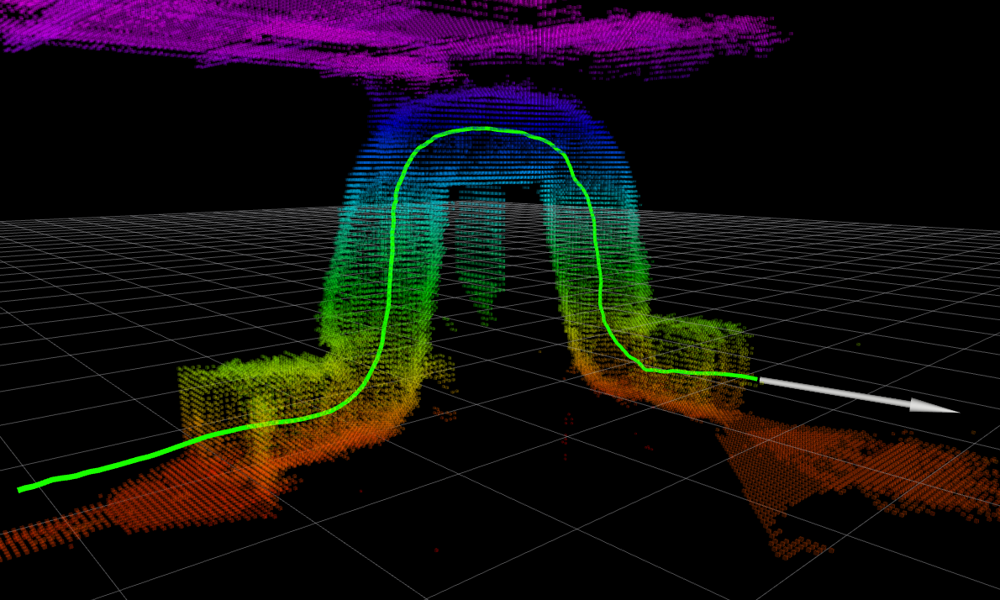
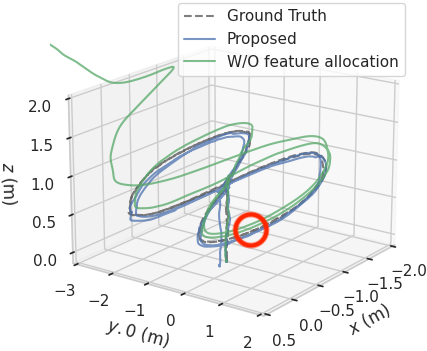

# VINS-Multi
## A robust optimization-based asynchronous Multi-camera-IMU state estimator



 

VINS-Multi is a robust optimization-based asynchronous multi-camera-IMU state estimator, which achieves accurate self-localization for autonomous applications (drones, cars, and AR/VR). VINS-Multi is an extension of [VINS-Fusion](https://github.com/HKUST-Aerial-Robotics/VINS-Fusion), which supports multiple asynchronous visual-inertial sensor types (stereo camera modules + IMU, RGB-D camera modules + IMU). 

**Features:**
- multiple asynchronous sensors support (stereo camera modules + IMU, RGB-D camera modules + IMU)
- online spatial calibration (transformation between cameras and IMU)
- online temporal calibration (time offset between cameras and IMU)
- handles partial camera modules failures

**Authors:** Luqi Wang, Yang Xu, and [Shaojie Shen](http://www.ece.ust.hk/ece.php/profile/facultydetail/eeshaojie) from the [Aerial Robotics Group](http://uav.ust.hk/), [HKUST](https://www.ust.hk/)

**Videos:**

<a href="https://www.youtube.com/embed/Zom2qmBTa0E" target="_blank"></a>


**Related Paper:** (paper is not exactly same with code)

* **VINS-Multi: A Robust Asynchronous Multi-camera-IMU State Estimator**, Luqi Wang, Yang Xu, and Shaojie Shen, 3rd Workshop on Future of Construction: Lifelong Learning Robots in Changing Construction Sites, IEEE International Conference on Robotics and Automation (ICRA, 2024), **Best research award** [pdf](https://arxiv.org/abs/2405.14539)


*If you use VINS-Multi for your academic research, please cite our related paper:

```
@article{wang2024vins,
  title={VINS-Multi: A Robust Asynchronous Multi-camera-IMU State Estimator},
  author={Wang, Luqi and Xu, Yang and Shen, Shaojie},
  journal={arXiv preprint arXiv:2405.14539},
  year={2024}
}
```

## 1. Prerequisites
### 1.1 **Ubuntu** and **ROS**
Ubuntu 64-bit 20.04.
ROS Noetic. [ROS Installation](http://wiki.ros.org/ROS/Installation)


### 1.2. **Ceres Solver**
Follow [Ceres Installation](http://ceres-solver.org/installation.html).


## 2. Build VINS-Fusion
Clone the repository and catkin_make:
```
    cd ~/catkin_ws/src
    git clone https://github.com/HKUST-Aerial-Robotics/VINS-Multi.git
    cd ../
    catkin_make
    source ~/catkin_ws/devel/setup.bash
```
(if you fail in this step, try to find another computer with clean system or reinstall Ubuntu and ROS)

## 3. Intel Realsense L515 + D435 camera modules Example
Download [realsense_raw_515_435.bag](https://hkustconnect-my.sharepoint.com/:u:/g/personal/lwangax_connect_ust_hk/ET9mwzUWOfFHi8peXYDYQesBQFOo08KqS0ZY_HPqsTu-xg?e=hsBbCc) to YOUR_DATASET_FOLDER.
Open four terminals, run vins odometry, rviz and play the bag file respectively. 
Green path is VIO odometry.
```
    roslaunch vins_multi vins_rviz.launch
    roslaunch vins_multi multi_l515_d435.launch
    rosbag play YOUR_DATASET_FOLDER/realsense_raw_515_435.bag
```




## 4. Run with your devices 
VIO is not only a software algorithm, it heavily relies on hardware quality. For beginners, we recommend you to run VIO with professional equipment, like Intel Realsense camera modules.

### 4.1 Configuration file
Write a config file for your device. You can take config files of the previous example. 

### 4.2 Camera calibration
VINS-Multi follows VINS-Fusion and support several camera models (pinhole, mei, equidistant). You can follow the same calibration procedure in VINS-Fusion to calibrate the cameras. For example:
```
rosrun camera_models Calibrations -w 12 -h 8 -s 80 -i calibrationdata --camera-model pinhole
```


## 8. Acknowledgements
We use [ceres solver](http://ceres-solver.org/) for non-linear optimization and a generic [camera model](https://github.com/hengli/camodocal).

## 9. License
The source code is released under [GPLv3](http://www.gnu.org/licenses/) license.

We are still working on improving the code reliability. For any technical issues, please contact Luqi Wang <lwangaxATconnect.ust.hk> and Yang Xu <yxuewATconnect.ust.hk>.

For commercial inquiries, please contact Shaojie Shen <eeshaojieATust.hk>.
